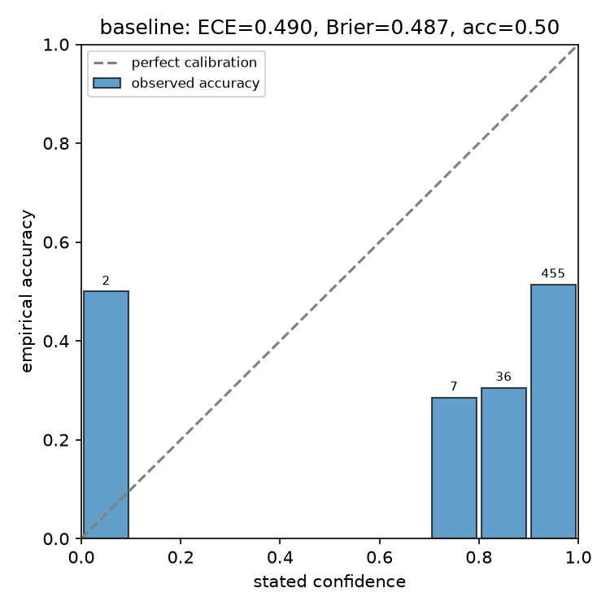
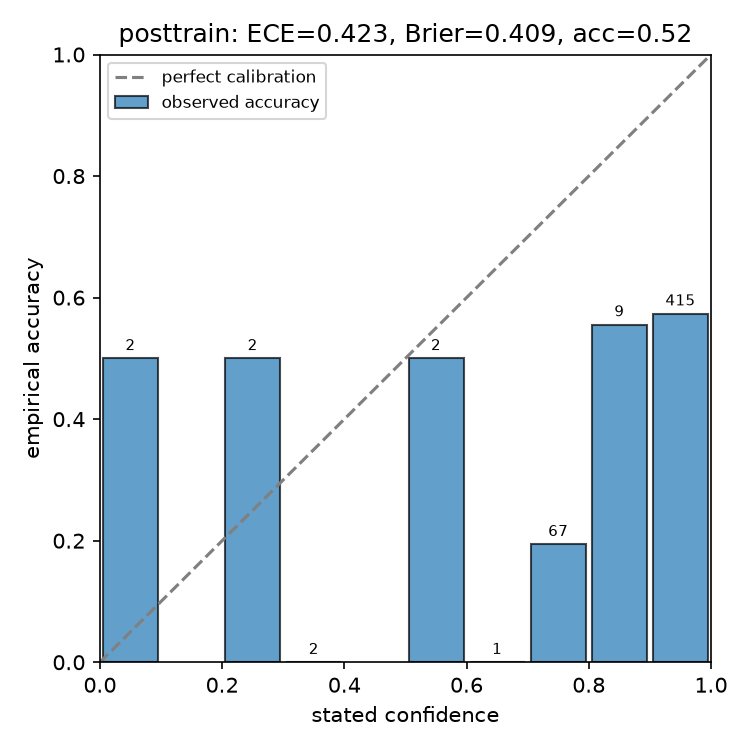
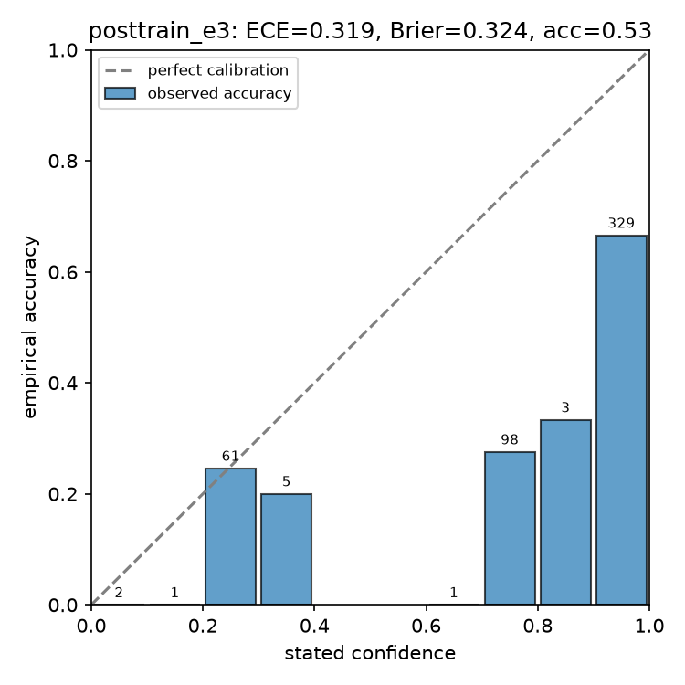

# rlcd

A small, from-scratch demo of **RLCD-style, label-free preference training**
applied to **confidence calibration** — inspired by two unrelated things that
happen to share the acronym RLCD:

- **Reinforcement Learning from Contrastive Distillation**
  ([Yang et al. 2023](https://arxiv.org/abs/2307.12950)): align a language
  model to a natural-language principle without human raters, by sampling
  two completions from a *positive* vs. *negative* steering prompt and using
  that contrast as an automatic preference signal.
- **Reinforcement Learning for Calibrated Decisions** (TypeSafe AI's Jev
  model): instead of training a model to produce answers humans approve of,
  train it so its *stated confidence* matches how often it's actually
  right — if it says 80%, it should be correct about 80% of the time.

This project combines them: it uses the RLCD contrastive-generation trick to
build a preference dataset **with no human labels**, but scores each side
with an explicit calibration reward (a proper scoring rule on stated
confidence vs. correctness) instead of assuming the positively-steered
completion always wins. It then LoRA/DPO-fine-tunes a small model on those
pairs and measures whether its confidence gets better calibrated.

## Pipeline

1. **`rlcd.eval`** — ask the base model MCQ questions from MMLU, have it
   report an answer *and* a 0-100% confidence, and compute Expected
   Calibration Error (ECE), Brier score, and a reliability diagram.
2. **`rlcd.generate_preferences`** — for each training question, sample one
   completion under a "be honestly calibrated" system prompt and one under a
   "be overconfident regardless" system prompt. Score both with a
   calibration reward (negative Brier score against ground truth), keep the
   higher-scoring one as `chosen`. The *stored* prompt uses a neutral system
   message for both sides, so the model can't just learn to key off which
   steering prompt was used — it has to learn calibrated behavior itself.
3. **`rlcd.train`** — LoRA fine-tune via `trl.DPOTrainer` on those pairs.
4. **`rlcd.eval`** again, on the same held-out split, with the trained
   adapter — compare before/after.

Model: `Qwen/Qwen2.5-1.5B-Instruct`. Data: MMLU (`cais/mmlu`, `all` config),
3000 questions for preference generation, 500 held out for eval, disjoint,
fixed seed.

## Result (1237 preference pairs, same held-out 500 questions throughout)

| | accuracy | Brier score | ECE |
|---|---|---|---|
| baseline | 0.496 | 0.487 | 0.490 |
| after RLCD/DPO, 1 epoch | 0.518 | 0.409 | 0.423 |
| after RLCD/DPO, 3 epochs | 0.526 | 0.324 | **0.319** |





More epochs on the same small, label-free preference set kept improving
calibration with no sign of collapse: ECE dropped a further ~25% (0.423 ->
0.319) going from 1 to 3 epochs, Brier score similarly, and accuracy held
steady/ticked up. This isn't the model just learning to state one fixed
"safe" confidence — the 3-epoch reliability diagram shows it now uses a
distinct low-confidence cluster (20-40%, ~66/500 answers) that is itself
reasonably well calibrated (~24% empirical accuracy against a 20-40% stated
range), on top of a much better-calibrated top bin (90-100% confidence is
now ~67% accurate, up from ~52% baseline). **It's still overconfident in
the 70-90% band** (only ~28-33% actual accuracy there) and still far from
perfectly calibrated overall — a genuine, still-improving result rather
than a solved problem. Training loss and DPO reward accuracy on the
training pairs also kept improving through all 3 epochs (loss 0.65 -> 0.53
avg, reward accuracy ~60-68% -> ~75-85%), so more epochs, more preference
data, or a larger LoRA rank are all plausible next steps to push further.

## Running it

Training needs a CUDA GPU (this was run on an RTX 5070 over SSH — see
`scripts/sync.sh` / `scripts/sync_back.sh`). Locally:

```
uv sync
uv run python -m rlcd.eval --n 500 --out-prefix baseline
uv run python -m rlcd.generate_preferences --n 3000
uv run python -m rlcd.train
uv run python -m rlcd.eval --n 500 --adapter outputs/lora_adapter --out-prefix posttrain
```
